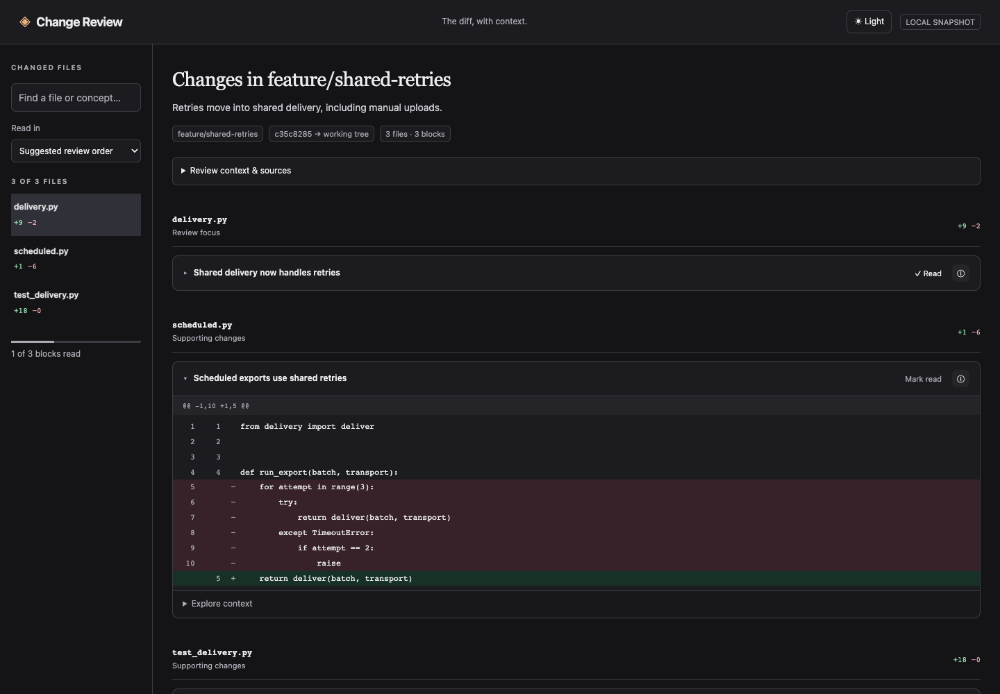

<p align="center">
  <a href="docs/assets/screenshot.png">
    
  </a>
</p>

<p align="center">
  
</p>

<h1 align="center">Change Review</h1>

<p align="center"><strong>Understand the code your agent just wrote.</strong></p>

<p align="center">
  A Git diff with the context you need to make it yours.<br>
  Hover for the explanation. Follow the evidence. Keep your place.
</p>

<p align="center">
  <a href="#quick-start">Get started</a> ·
  <a href="#choose-your-change">Review a branch or PR</a> ·
  <a href="#bring-your-existing-agent-session">Use your agent session</a> ·
  <a href="#what-to-know">How it works</a>
</p>

---

Coding agents can produce a change faster than you can build a mental model of it.
Change Review helps you catch up: the actual diff, short explanations beside the
code, and source links you can open to check the story.

**One command produces one self-contained HTML review.** Open it in your browser
or Claude Desktop. No web server, database, npm install, or Python packages needed.

**Dark by default.** Use the **Light / Dark** button in the header to switch themes.
Your browser remembers your choice.

> The screenshot shows the working viewer with a fictional delivery library.
> This is an early, usable prototype; explanations are suggestions for your review.

## A diff you can explore

| While you read                 | What you get                                                                                                                                                   |
| ------------------------------ | -------------------------------------------------------------------------------------------------------------------------------------------------------------- |
| **Find the important parts**   | Scroll through every file in suggested review order: focus changes first, supporting changes next, mechanical changes last. Switch to file path order anytime. |
| **Hover, then go deeper**      | A short consequence on hover or keyboard focus; expand context inline for rationale, connected edits, and evidence.                                            |
| **Understand the reason**      | A brief takeaway beside the diff; rationale stays behind **Explore context**, labeled **stated intent**, **inferred**, or **unknown**.                         |
| **Check the evidence**         | Open captured source excerpts with file paths, line numbers, and before/after labels.                                                                          |
| **Follow the whole change**    | One file list follows your scroll. Connected-change links jump to related edits; cited unchanged files are available in source evidence.                       |
| **Pick up where you left off** | Mark a block as read to collapse it. Expand it again without clearing its read marker. Read progress is saved for that exact snapshot.                         |

New annotations have character budgets: a short overall summary, one takeaway per
block, and a brief hover explanation. Specific review questions remain visible.
Long summaries from older annotations remain available under **Review context & sources**.
Suggested order reflects model annotations, not a verified risk score; unannotated
blocks stay visible, and hunks within each file keep their source order.

## Quick start

**You need:** Python 3.10+ and Git. For generated explanations, install and sign in
to [Claude Code](https://code.claude.com/docs/en/overview).

```bash
git clone https://github.com/kirilklein/change-review.git
cd change-review

python3 review.py \
  --repo /path/to/your/worktree \
  --base origin/main \
  --intent "Let manual uploads recover from temporary failures" \
  --explain --open
```

Use your repository's base branch—for example, `origin/dev` instead of
`origin/main`. If Claude needs a login, run `claude auth login` first.

**Just want the diff and source context?** Leave out `--explain`. That mode makes
no model calls. Add explanations later using an existing agent session.

## Choose your change

Run these commands from the Change Review directory. Add `--explain` for Claude
annotations and `--open` to open the result.

```bash
# Local edits: staged, unstaged, and untracked files compared with HEAD
python3 review.py --repo /path/to/worktree

# Your branch plus local edits, since it diverged from the base branch
python3 review.py --repo /path/to/worktree --base origin/main

# A committed branch, ignoring local edits
python3 review.py --repo /path/to/repo --base origin/main --head feature-name

# A pull request, including its description and exact commit IDs
python3 review.py --repo /path/to/repo --pr 123
```

PR URLs also work. PR mode requires an authenticated [GitHub CLI](https://cli.github.com/)
and the PR's base and head commits in your local repository. Fetch them first if
needed. Change Review does not fetch, switch branches, stage files, or edit the
repository you are reviewing.

## Bring your existing agent session

The agent that wrote the change already has useful context. You can ask that
session to annotate a captured review instead of starting a new Claude call.

**1. Capture the change.**

```bash
python3 review.py --repo /path/to/worktree --base origin/main \
  --intent "Your original request" --output /tmp/my-review
```

**2. Give the agent the generated request.**

> Read `/tmp/my-review/request.txt` and write the requested JSON to
> `/tmp/my-review-annotations.json`. Use the supplied source evidence. Keep
> additional session rationale labeled as inferred unless it is also in the
> captured intent. Do not edit the code.

**3. Open the annotated snapshot.**

```bash
python3 review.py --snapshot /tmp/my-review/snapshot.json \
  --annotations /tmp/my-review-annotations.json \
  --output /tmp/my-review-explained --open
```

Annotations must match the snapshot ID, and every source and change link is
validated. Explanations from a different snapshot are rejected.

<details>
<summary><strong>What gets generated?</strong></summary>

Each run creates a new output directory containing:

| File               | Purpose                                                      |
| ------------------ | ------------------------------------------------------------ |
| `index.html`       | The portable review, ready to open.                          |
| `snapshot.json`    | The captured diff, source excerpts, intent, and commit IDs.  |
| `request.txt`      | The complete request an agent can use to write explanations. |
| `annotations.json` | Explanations, when generated or imported.                    |

Without `--output`, the tool creates a unique temporary directory. Existing output
directories are refused so a new review cannot overwrite an earlier one. Keep
outputs outside the repository being reviewed.

To view a review in Claude Desktop, open the HTML file path in its Code tab's
Browser pane.

</details>

## What to know

**Git supplies the diff. Claude supplies the explanations. You make the judgment.**

- **A fixed snapshot.** Regenerate after edits. Before/after excerpts stay attached
  to the captured version.
- **Visible evidence.** The source excerpts sent to the model are also available
  in the viewer. Context includes changed-file excerpts, README/overview text, and
  up to eight files containing references to changed declarations.
- **Bounded context.** Source context is capped at 80,000 characters. References are lexical
  matches, not a verified runtime call graph. Renames appear as deletion and addition.
- **Explicit omissions.** Binary files, symlinks, submodules, files over 300 KB,
  common credential filenames, and protocol JSON are omitted with visible reasons.
  Additional files are omitted when the diff would exceed 250,000 characters.
- **Your Claude account.** `--explain` sends the captured diff, context, and intent
  through your existing Claude CLI login. It starts a fresh session with no tools
  or configured MCP servers. Optional `--model` selects a model.
- **Portable means source included.** The HTML contains captured code. The filename
  exclusions are not a secret scanner; inspect the snapshot before sharing it.

A failed model call leaves the unannotated review and request available. You can
retry using `--snapshot` or import annotations from another session.

## Development

The [marketing and launch plan](docs/marketing-plan.md) records the positioning,
demo storyboard, pilot, and launch steps.

```bash
python3 -m unittest -v
```

With Black and Flake8 installed, check Python formatting and lint with:

```bash
black --check review.py test_review.py
flake8 review.py test_review.py
```

The lint configuration uses Black's 88-character line length and slice spacing.

The tests cover Git comparisons, captured source versions, exclusions, annotation
validation, safe HTML embedding, and the CLI transport with a fake Claude process.
They make no model calls.

The tool lives in two files: `review.py` captures and annotates the change;
`viewer.html` renders it. Run `python3 review.py --help` for every option.
